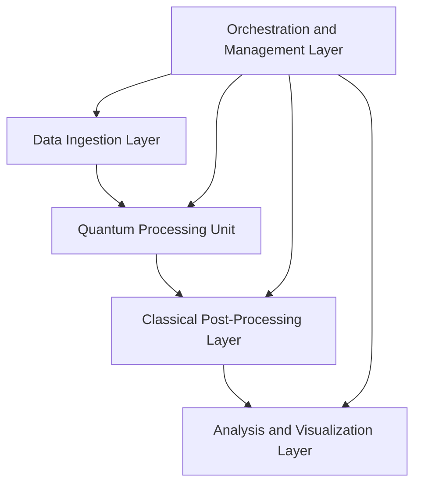
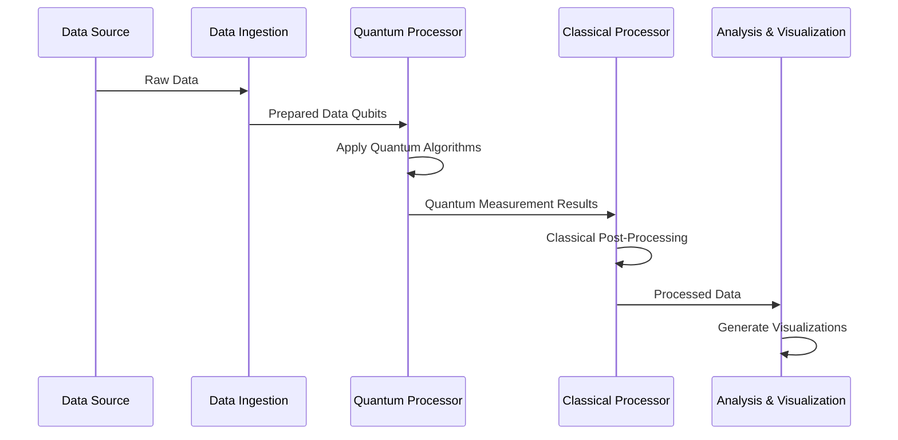
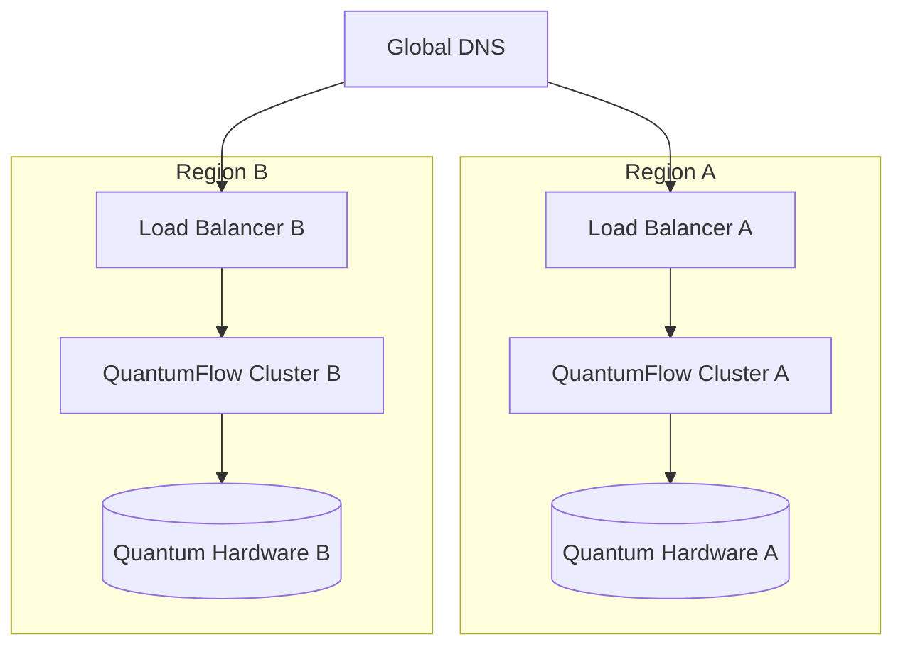

# QuantumFlow: A Next-Gen Data Processing Pipeline

<div align="center">
  
  <p><em>Harnessing the power of quantum computing for big data processing</em></p>
</div>

## Table of Contents
- [Overview](#overview)
- [Architecture](#architecture)
- [Key Components](#key-components)
- [Data Flow](#data-flow)
- [Performance Metrics](#performance-metrics)
- [Deployment](#deployment)
- [API Reference](#api-reference)
- [Future Roadmap](#future-roadmap)

## Overview

QuantumFlow is a cutting-edge data processing pipeline that leverages quantum computing algorithms to process and analyze massive datasets at unprecedented speeds. This document outlines the technical specifications and architecture of the QuantumFlow system.

<details>
<summary>Key Features</summary>

- Quantum-accelerated data processing
- Real-time analytics on petabyte-scale datasets
- Self-optimizing algorithms
- Fault-tolerant distributed architecture
- Seamless integration with existing data infrastructures

</details>

## Architecture

The QuantumFlow architecture consists of five primary layers:



Each layer is designed to work in harmony, ensuring efficient data flow and processing.

## Key Components

| Component | Description | Technology Stack |
|-----------|-------------|-------------------|
| Data Ingestion | Handles data input from various sources | Apache Kafka, Apache Flink |
| Quantum Processing | Performs quantum algorithms on data | Custom Quantum Circuits, Qiskit |
| Classical Post-Processing | Interprets quantum results | Python, C++ |
| Analysis and Visualization | Presents insights to users | D3.js, Tableau |
| Orchestration | Manages the entire pipeline | Kubernetes, Istio |

## Data Flow

The following sequence diagram illustrates the data flow through the QuantumFlow system:



## Performance Metrics

QuantumFlow achieves unprecedented performance in data processing:

<div class="performance-chart">
  <canvas id="performanceChart"></canvas>
</div>

<script src="https://cdn.jsdelivr.net/npm/chart.js"></script>
<script>
document.addEventListener('DOMContentLoaded', function() {
  var ctx = document.getElementById('performanceChart').getContext('2d');
  var chart = new Chart(ctx, {
    type: 'bar',
    data: {
      labels: ['Traditional', 'GPU-Accelerated', 'QuantumFlow'],
      datasets: [{
        label: 'Processing Time (ms)',
        data: [1000, 500, 50],
        backgroundColor: ['#FF6384', '#36A2EB', '#FFCE56']
      }]
    },
    options: {
      responsive: true,
      title: {
        display: true,
        text: 'Data Processing Performance Comparison'
      }
    }
  });
});
</script>

## Deployment

QuantumFlow can be deployed in various configurations. Here's an example of a highly available setup:



## API Reference

QuantumFlow exposes a RESTful API for integration. Here's a sample endpoint:

```python
@app.route('/api/v1/process', methods=['POST'])
def process_data():
    data = request.json
    result = quantum_process(data)
    return jsonify(result)
```

For full API documentation, see our [API Reference](api-reference.md).

## Future Roadmap

- Q4 2023: Integration with quantum error correction algorithms
- Q2 2024: Support for topological quantum computing
- Q3 2024: Launch of QuantumFlow Cloud Service

---

<div align="center">
  <p>For more information, contact our <a href="mailto:quantum@example.com">quantum computing experts</a>.</p>
  <p>© 2023 QuantumFlow Technologies</p>
</div>
